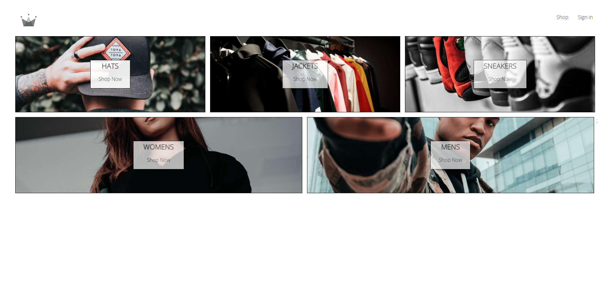
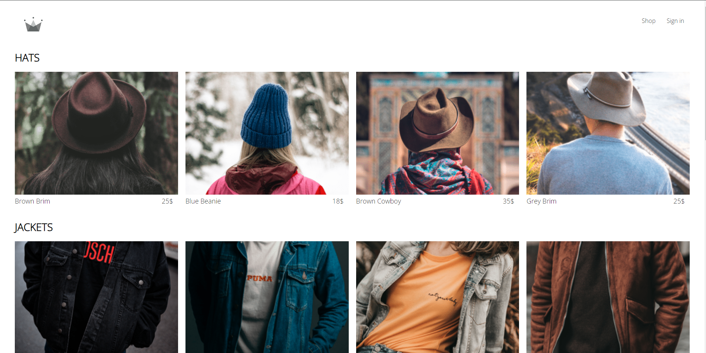
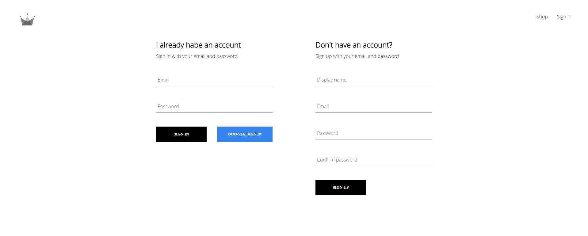

<h1 align="center" id="title">🛒 Shop-Website 🛒</h1>

<p align="center"></p>

<p id="description">Shop-Website is a project where is a dublicate of a real shop website with a variety of categories and products you can choose from. You can Sign-In or Sign-Up in order to be able to add some of your favorite products to the cart. When you finish choosing your favorite product you can easily go to the Checkout page and see the cost of your products. The project demonstrates my ability to work with a more complex React project the ability to navigate through different components and work with React Context. For the DB authentication and authorization I'm using Firestore/Firebase.</p>

<h2>🚀 Demo</h2>

[https://shop-website-k-y.netlify.app/](https://shop-website-k-y.netlify.app/)

<h2>📸 Project Screenshots:</h2>





<h2>🛠️ Installation Steps:</h2>

<p>1. Clone the repository</p>

```
git clone https://github.com/Kalo116/Shop-Website.git
```

<p>2. Enter the project folder</p>

```
cd .\Shop-Website
```

<p>3. Install all dependencies</p>

```
npm install
```

<p>4. Start the project</p>

```
npm start
```

  
  
<h2>💻 Built with</h2>

Technologies used in the project:

*   React
*   Firebase/Firestore
*   SASS
*   React-Router-DOM
